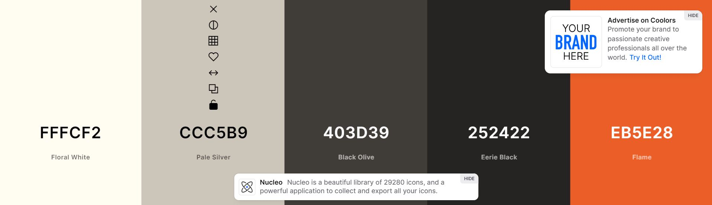

# rpjsazon-portfolio

## Github Webpage Link:

## Link: https://rpjsazon.github.io/rpjsazon-portfolio/

---

### This is my bootcamp porfolio as a front-end developer.
---
### To start my project, I created a repository in GitHub with the README.md and MIT license. Then, clone the respository to my pc by using "git clone". 

## Color Palette
### I've use [coolors.co](https://coolors.co/) to generate my color palette.

## Wireframe
### I've used [PenPot App](https://penpot.app/) to visualized my website.

## GitHub
### I used Git to push my main branch to GitHub.

## Responsive Design

### By adding @media scree resolution. I managed to resize my webpage resolution, here are the results below.

### For Desktop:

### For Tablet:

### For Tablet:

